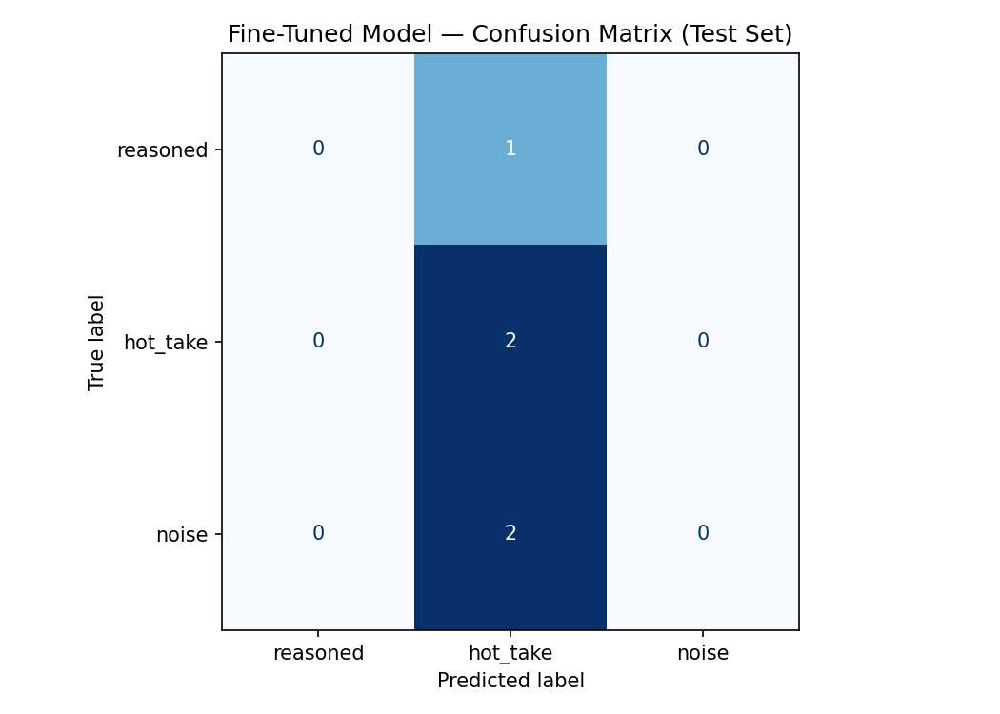

# TakeMeter

**AI201 · Project 3 — Fine-tuning a text classifier**

TakeMeter classifies short technical-discussion comments (the kind you see on
developer forums, PR threads, and Hacker News) into three categories, then
compares a fine-tuned [DistilBERT](https://huggingface.co/distilbert-base-uncased)
model against a zero-shot large-language-model baseline (Groq
`llama-3.3-70b-versatile`).

## Labels

| Label | Meaning | Example |
|-------|---------|---------|
| `reasoned` | A substantive opinion backed by a tradeoff, an experience, or evidence. | *"We moved off microservices back to a monolith — the network overhead outweighed the team-autonomy benefit at our ~15-engineer scale."* |
| `hot_take` | A strong, absolutist opinion stated with no supporting reasoning. | *"ORMs are a cancer and anyone who uses them doesn't understand databases."* |
| `noise` | Low-content reactions, memes, or filler that carry no opinion. | *"skill issue"* |

See [`planning.md`](planning.md) for the full taxonomy, label definitions, and
dataset-design notes.

## Repository contents

| File | Description |
|------|-------------|
| [`planning.md`](planning.md) | Label taxonomy, dataset design, and annotation decisions. |
| [`takemeter_sample.csv`](takemeter_sample.csv) | The labeled dataset (`text`, `label` columns). |
| `evaluation_results.json` | Metrics produced by the Colab notebook (baseline vs. fine-tuned accuracy). |
| `confusion_matrix.png` | Confusion matrix for the fine-tuned model on the test set. |

> The notebook itself lives in Colab and is **not** committed here — this repo
> holds the planning, dataset, and downloaded outputs.

## Dataset

`takemeter_sample.csv` has two columns, `text` and `label`, with the label
distribution:

| Label | Count |
|-------|-------|
| `reasoned` | 10 |
| `hot_take` | 10 |
| `noise` | 10 |

The Colab notebook splits this 70 / 15 / 15 into train / validation / test
(stratified, `random_state=42`).

## How the model is built

1. **Fine-tune** `distilbert-base-uncased` with a 3-class classification head
   for 3 epochs on a T4 GPU.
2. **Baseline** — classify the same test set zero-shot with Groq
   `llama-3.3-70b-versatile` using a prompt built from the label definitions.
3. **Compare** accuracy and per-class metrics, and save:
   - `evaluation_results.json` — `baseline_accuracy`, `finetuned_accuracy`,
     `improvement`, `test_set_size`, `label_map`, `model`.
   - `confusion_matrix.png` — fine-tuned model confusion matrix.

## Evaluation report

Metrics from [`evaluation_results.json`](evaluation_results.json), test set of 5
examples (`distilbert-base-uncased`):

| Model | Accuracy |
|-------|----------|
| Zero-shot baseline (Groq `llama-3.3-70b-versatile`) | **1.00** |
| Fine-tuned DistilBERT | **0.40** |
| Improvement | **−0.60** (regression) |

**Analysis.** The fine-tuned model **lost** to the zero-shot baseline here, and
the confusion matrix shows why: it predicted `hot_take` for **every** test
example — it collapsed to a single class rather than learning the boundaries.
The 70B baseline, by contrast, classified all 5 correctly.

This is the expected failure mode for a dataset this small. With only 30
examples the stratified split leaves ~21 for training and **5 for test**, far
too few for DistilBERT to learn three categories or for the test accuracy to be
meaningful (each example moves accuracy by 0.20). Three epochs on so little data
gives the classification head no signal to separate `reasoned` from `hot_take`,
so it defaults to the majority-ish class.

**What would close the gap:**

- **More data** — the project target of 200+ examples is the main lever; ~70+
  per class would give the model and the test set room to be informative.
- **More epochs / class weighting** to fight the single-class collapse on a
  small set.
- A larger held-out test split once there's enough data, so accuracy isn't
  quantized to multiples of 0.20.

For a dataset this small, the zero-shot LLM is simply the better classifier —
fine-tuning only pays off once there's enough labeled data to learn from.
